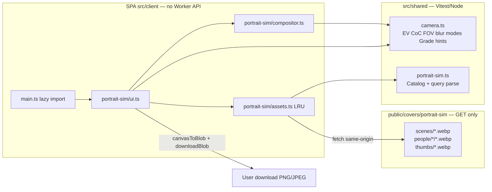
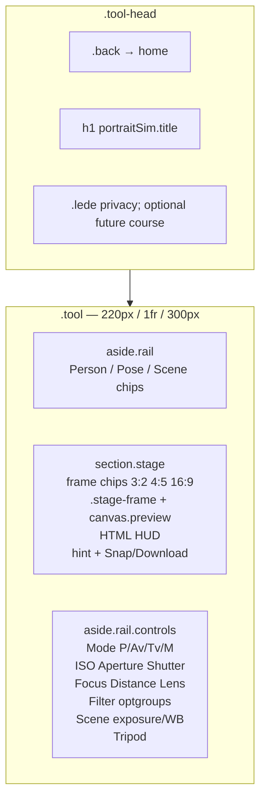
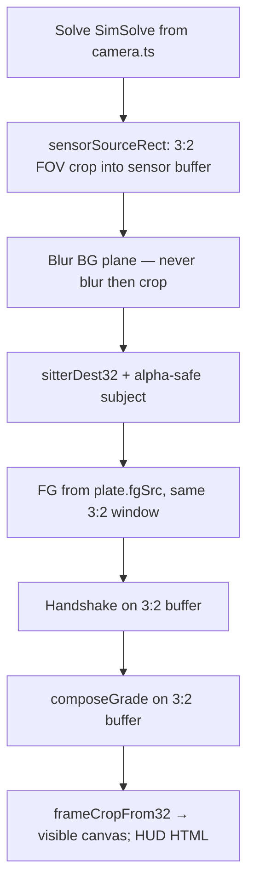
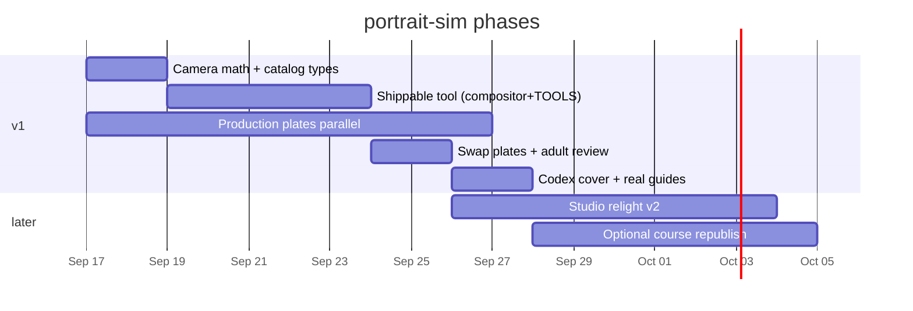

# Portrait photography camera simulator (`portrait-sim`)

| Field | Value |
|---|---|
| **Status** | Draft (revised after design review) |
| **Date** | 2026-09-16 |
| **Author** | Grok (design pass; implementation is a later, reviewed task) |
| **Repo** | `/Users/shon/Github/cvcm` |
| **Audience** | Senior engineers shipping cv.cm local tools |
| **Owner request** | 「cv.cm 帮我做一个都语言的人像摄影-相机模拟学习工具，多语言，可以自由更换摆姿，场景，人物，右侧可以调整相机参数，更换镜头，更换滤镜（UV 镜头），拍摄图片可以导出。可以进一步，模拟打光。先规划好，让 codex review ，再开工」; follow-up: 「界面风格与 cv.cm 统一」 |

Treat 「都语言」 as the site’s eight locales. This document is the plan Codex should review **before** any application code.

**Revision note.** A first draft treated `/{locale}/learn/portrait/` as a live 10-step course. That is **not** true in this tree today (`TUTORIAL_GROUPS = []`, unpublished learn URLs 301 to the hub, no `learn.portrait.*` copy, no portrait figures). v1 is a **standalone image tool**. A course republish is an optional later PR, not a v1 dependency.

---

## Overview

cv.cm is a vanilla TypeScript SPA of in-page tools plus a tiny clipboard API. Lessons are currently **unpublished**: `TUTORIAL_GROUPS` in `src/shared/path.ts` is empty while copy is rewritten; Worker `fetch` 301s `/{locale}/learn/{id}/` to the hub when `!isPublishedTutorial(id)`; client `render()` `replaceState`s the same way; `src/locales/en.json` `learn` is hub/groups only; `faq.learn` is `{}`. `TUTORIALS` still lists `"portrait"` so old URLs parse, then redirect. `TUTORIAL_META.portrait` and leftover `meta.titlePortrait` exist as stubs, not a shippable lesson.

This change adds a **standalone learn-by-doing image tool** with a CameraSim-style *interaction* (live viewfinder + right-hand exposure controls) and **cv.cm UI**. Users swap discrete **person / pose / scene** presets, set **P / Av / Tv / M**, ISO, aperture, shutter, focus distance, focal length / lens, tripod, **frame** (3:2 / 4:5 / 16:9), and filters (including a pedagogically honest **UV filter**, not a “UV lens”), then **snap and download** PNG/JPEG in the page.

The live viewfinder **cannot** call Imagine, OpenAI, or any other generation API: Worker CSP `connect-src` is `'self' https://files.s3.cv.cm https://s3.cv.cm` (`src/worker.ts`), and `AGENTS.md` rules 1, 5, and 7 forbid upload APIs, extra third-party hosts, and runtime image generation. The renderer is a **layered 2.5D Canvas2D compositor** over prebaked plates, with **pure camera math** in `src/shared/` so Vitest (Node) can lock EV, CoC/DOF, FOV, handshake, and exposure-mode solving.

Owner 「可以进一步，模拟打光」 is a **further** step: v1 is **scene exposure / white balance** on pre-lit plates; v2 is studio 3-point relight. Do not label the v1 control “Light” in a way that promises a moving key.

---

## Background & Motivation

### Current state (verified 2026-09-16)

- Image tools use `src/client/main.ts`: `tool-head` + `.tool` grid (`220px minmax(0,1fr) 300px` in `src/client/styles.css`), left `.rail`, center `.stage` + `.stage-frame` + canvas `.preview`, right `.rail.controls`.
- Home tiles **`TOOLS` in array order** (`src/client/home.ts`), not `CATEGORIES`. Nav menus follow `CATEGORIES`. Insert the id in **both**, after `collage`.
- Lessons hub shows `learn.hub.empty`: “Lessons are being rewritten around real search demand.” `FEATURED_TUTORIALS.length === 0`; the home learn wall is omitted. README still advertises a portrait session — that README is stale, not a live route.
- Runtime deps are only `pdf-lib` and `pdfjs-dist`. Canvas2D is the renderer (`watermark/engine.ts`, `collage/engine.ts`, `decode.ts`). **Zero** `ctx.filter` usages exist today; v1 introduces Gaussian `filter` as a new Canvas2D path, not an existing house helper.
- Cover source of truth is `src/shared/covers.ts` (`TOOL_COVER: Record<ToolId, string>`). `src/client/covers.ts` only re-exports.
- Locales: `en` `zh-CN` `zh-TW` `ja` `ko` `vi` `id` `es` with key parity (`tests/i18n-keys.test.ts`).
- Worker: static + locale + `/api/clip*`. Other mutating methods 405. **No new Worker API.** Redirects currently build `new URL(appHref(...), origin)` and **drop `url.search`**.
- `public/covers` is **21 MB** on disk (guides 7.4 MB). Cited draft files `learn-fig-portrait-light.jpg`, `learn-portrait-sweet.jpg`, and `public/covers/tutorials/` are **not in the tree**. `LEARN_COVER.portrait` still points at missing `/covers/tutorials/portrait-frames.svg`.
- `Permissions-Policy` includes `camera=()`. This tool must not call `getUserMedia`.
- `AGENTS.md` rule 6 (adults for fashion examples) still applies to any future lesson **and** to this tool’s sitters.

### Pain points

1. There is no in-page way to *see* FOV crop, relative subject size, DOF, exposure, and handshake, while the illustrated portrait course is unpublished. v1 does **not** warp facial proportions (flat cutouts).
2. CameraSim-class products teach this well, but cloning their dark DSLR UI would break cv.cm, and the reference screenshot used a **child** — forbidden.
3. Runtime generative fill is a CSP violation and a safety liability.

### Why now

The owner asked for the tool, multilingual, lighting as a designed next step, and **plan first**. v1 does not wait on the lesson rewrite.

---

## Goals & Non-Goals

### Goals (v1 must ship)

1. A new image-category tool at `/{locale}/portrait-sim/` that simulates a portrait sitting **as a standalone tool**.
2. Full 8-locale key parity (UI, `tools.*`, `meta.*`, `faq.*`, `guides.*`).
3. Discrete preset swap: **person**, **pose**, **scene** (not a 3D puppeteer).
4. Right-hand camera: **P / Av / Tv / M**, ISO, aperture, shutter, focus distance, lens / focal length, tripod, snap + export PNG/JPEG via `downloadBlob` (`src/client/dom.ts`) and `canvasToBlob` (`src/client/decode.ts` — **`HTMLCanvasElement` only**).
5. Lens set: **phone 26 mm-e** plus **24 / 35 / 50 / 85 / 135 mm** full-frame equivalents. Changing lens changes FOV, 2.5D perspective compression, and DOF. **135 mm export long edge is 1280 px** (catalog constant).
6. Filters: none, **UV** (identity on digital — teaching beat), ND 3-stop, ND 6-stop, CPL, diffusion/soft, warming, cooling. Select uses **optgroups** (Protection / Exposure / Look). Never labeled as a “UV lens.”
7. **Scene exposure / white balance** presets: sunny, open shade, window, overcast, golden hour. Each sets scene EV100, a 3×3 color matrix, and contrast. This is **not** 打光. Studio 3-point / normal relight is v2.
8. Exposure, 3-plane Gaussian DOF, and isotropic handshake blur visible in the viewfinder.
9. Short cv.cm-tone teaching hints when settings are wrong — photography first, not a game score.
10. Frame chips **3:2** (default), **4:5**, and **16:9**. Portrait teaching needs a vertical option; 16:9-only would look like a landscape toy.
11. Shareable query string (`?scene=window&lens=50`) that **survives Worker redirects and SPA `replaceState`**. Valid query keys override localStorage.
12. UI unified with cv.cm. Adults only. No D1, no S3, no new Worker routes, no extra CSP hosts.

### Non-goals (v1)

- Republishing `/{locale}/learn/portrait/` or any other lesson. Keep a one-line lede that a photography course may return; do not deep-link, do not edit missing `learn.portrait.*` keys, do not add `TUTORIAL_META.portrait.related`.
- Real camera / `getUserMedia`. Leave `camera=()`.
- User-uploaded backgrounds or faces.
- Three.js / glTF / skeletal posing / cloth sim.
- Runtime image generation.
- Landscape, sports, astro, or product modes.
- Full EXIF writing on export.
- RAW, flash TTL, IBIS, rolling shutter, dual-pixel AF animation.
- Cloning CameraSim’s dark chrome, brand, or asset set.
- Any minor as a portrait subject (no playground, no school-child JK, no age-ambiguous “idol”).
- New analytics, accounts, or upload APIs.
- Per-pixel CoC discs, directional motion blur, or moving a key across a face (v2).
- **Warping facial proportions** (close-wide “big nose”). The cutout is a flat card; `wideClose` is a hint only.
- Extra mira sailor-collar wardrobe (v2, +4 cutouts). Adult lolita person (v2).
- Publishing `TOOLS` / homepage / HowTo JSON-LD before the compositor draws a silhouette viewfinder.
- Auto ISO toggle, or Auto ISO in Av/Tv/M.

---

## Key Decisions

| Decision | Choice | Rationale |
|---|---|---|
| Tool id | **`portrait-sim`** | Portrait-only asset set; does not echo CameraSim; does not imply `getUserMedia`. Hyphenated ids already exist (`audio-cutter`). |
| Category + index | **`image`**, after **`collage` in both `TOOLS` and `CATEGORIES`** | Home follows `TOOLS`; nav follows `CATEGORIES`. |
| v1 product | **Standalone tool** | Lessons are unpublished. Course republish is a later PR with a hook in the lede only. |
| Renderer | **B — layered 2.5D Canvas2D** | CSP forbids runtime gen; Three.js is too heavy; combinatorial plates explode. `ctx.filter` is new to this repo but still Canvas2D. |
| Camera math | **`src/shared/camera.ts`**, CoC in **millimetres after converting metres** | Vitest is Node. Mixed units would clamp every plane to max blur. |
| Catalog | **Typed `Catalog` in `src/shared/portrait-sim.ts` in PR 1** | World units, plate focals, feet-line, default exposure preset, match scale — not ids-only. |
| Compositor | **Canonical 3:2 sensor, then aspect-crop; crop-then-blur; alpha-safe; same `Grade` as tests** | HFOV is always 36 mm-wide 3:2. 4:5/16:9 are post-crops, not new sensors. No CSS `sepia()`. Export from `HTMLCanvasElement`. |
| Cover record | Edit **`src/shared/covers.ts`** | Client file is a re-export. |
| Cover art | Temporary in-repo JPEG in **PR 2** (shippable compositor); **Codex** sweet cover in PR 4 | `AGENTS.md` rule 7. Do not use Grok `image_gen`. Do not copy a missing `learn-portrait-sweet.jpg`. |
| Subjects | **Illustrated adults, 25+**; mira casual, ken casual, lin hanfu | Age-unambiguous. Sailor-collar wardrobe is v2. |
| Scenes | **Empty stages** (photographic preferred, illustrated OK), no people | No playground. Do not use missing still-life files as placeholders. |
| Art direction | **Frozen now** (illustrated sitters + empty stages, not chibi) | 20 production images cannot wait on an open Q1. |
| v1 “lighting” | **Copy: “Scene exposure / white balance.”** Data field stays `light` | Owner 打光 is v2 (normals + WebGL key/fill/rim). Pre-lit cutouts + grade-only is an accepted v1 look. |
| Filters | **UV identity + Protection optgroup + FAQ** | Correct photography; avoids “the control is broken.” |
| Frame | **3:2 default, plus 4:5 and 16:9 chips; chips crop a 3:2 buffer** | Owner asked for 人像. Aspect must not change the sitter’s angular size. |
| 135 mm long edge | **1280 px** | Dual-FOV plates; do not upscale a thin crop to 1920. |
| Query | **Preserve `url.search` on Worker redirects, `boot()` `replaceState`, and `langSwitch`** | `langSwitch` currently `pushState`s `appHref` with no search (`src/client/main.ts`). Query > localStorage > defaults. |
| Engine library | **No Three.js, no new npm runtime dep** | `pdf-lib` + `pdfjs-dist` only. |
| Asset budget | **≤ 8 MB** WebP on disk; first paint **≤ 1.2 MB** (wide + FG + cutout + thumbs) | Window default loads FG. Four FG WebPs are extra bytes. |
| Decoded memory | **LRU cap 8 `ImageBitmap`s** (current/previous plate, current/previous FG, four poses) | One 3072×2048 RGBA buffer is ~25 MB. Cafe needs FG. |
| Plate authoring | **Starts in parallel with PR 1** | Critical path, not a side task after the shell. |
| Privacy | **No user files, no upload, no D1/S3** | Snap is a local download. |
| Filename | **`outputFilename("portrait-sim.png", mime, "")`** | Avoid `portrait-portrait.png`. |
| Foreground | **`PlateSpec.fgSrc` per wide/tele**, same pixels as that plate | One FG file cannot match 3072 and 2048. Indoor/shade `null`. |
| Distance | **Slider moves the sitter (camera fixed).** Per-scene `distanceMinM` / `distanceMaxM` so sitter stays in front of BG and behind FG | Indoor bg 3.5 m vs 8 m would invert paint order. |
| MATCH reframe | **Feet→floor, then 3:2 eye lift, then pan destY so the *final crop* still has 8% headroom** | 16:9 crop y=75 would still clip the forehead if headroom is only on uncropped 3:2. Scale unchanged. |
| Ship gate | **Do not add `portrait-sim` to `TOOLS` until the viewfinder composites on silhouettes** | `main` auto-deploys. No “Loading…” homepage tile. Merge old 2a+2b into one PR. |
| Auto ISO | **P-only.** Default Av uses the ISO slider. No Auto ISO toggle in v1 | `autoIso` true on Av would have no UI and no solver. |
| Facial warp | **v1 does not warp faces.** FOV crop + scale + DOF + exposure + handshake | Flat cutout cannot fatten a nose. `wideClose` is copy-only. |
| Phone DOF | **`LensSpec.sensorWidthMm`**: phone 6.4 mm; other lenses 36 mm | Phone vs 85 mm DOF comparison is true only on a small-sensor CoC path. |
| Soft live | **Cheap live bloom when filter is `soft`** | Skipping bloom hides the only visible Soft effect. |
| Blur kernel | **`cocDiameterPx` vs `gaussianSigmaPx = diameter/2`** | CSS `blur()` is σ, not CoC diameter. Scale with render width. |
| Alpha | **Premultiplied `filter=blur` on a transparent layer** | `max(α, blur(α))` after opaque pad makes outer coverage p² (dark ring). |
| Memory | **Per-scene distance clamp; destH uncapped; rasterize dest ∩ sensor+pad; decoded+live+scratch+snap ≤ 64 MB** | destH clamp made 85 mm and 135 mm the same size. Native 3072 LRU can exceed 90 MB. |
| Export size | **Never upscale.** `min(desired, source crop)` per lens **and** frame | 135 mm 4:5 must not invent pixels. |
| P-mode phone | **`apertureLocked` → `N = maxAperture`; skip f/4 band** | `clamp(4, 2.8, 1.8)` is inverted. Phone `minAperture: 1.8`. |

---

## Proposed Design

### Architecture



No `connect-src` beyond `'self'`. Plates are static. Snap never uploads.

### Route, mount, category

Follow `AGENTS.md` rule 5. **Also** add `portrait-sim` to the in-page image list in hard rule 1 and a layout bullet `src/client/portrait-sim/`.

1. Insert `"portrait-sim"` **immediately after `"collage"`** in **both** `TOOLS` and `CATEGORIES[image].tools` in `src/shared/path.ts`:

```ts
export const TOOLS = [
  "clip", "qr", "barcode",
  "watermark", "collage", "portrait-sim", "resize", "crop", /* … */
];

{ id: "image", tools: [
  "watermark", "collage", "portrait-sim", "resize", "crop", "rotate",
  "exif", "meme", "signature", "favicon", "screenshot",
] }
```

Home tiles follow `TOOLS`; the image nav group follows `CATEGORIES`. Sitemap iterates `TOOLS` (`src/shared/sitemap.ts`).

2. `parseAppPath` / `appHref` pick it up automatically. Bare `/portrait-sim` 302s via the existing Worker locale redirect. **Do not add a Worker route.** **Do** preserve search (next subsection).

3. Lazy-import from `src/client/main.ts` (PDF pattern):

```ts
} else if (tool === "portrait-sim") {
  const gen = pageGen; // captured **before** the dynamic import
  const mod = await import("./portrait-sim/ui");
  if (gen !== pageGen) return; // navigated away; do not install unmount or mount
  unmountPortraitSim = mod.unmountPortraitSim;
  await mod.mountPortraitSim(main);
}
```

4. `unmountTools()` calls `unmountPortraitSim()` and resets the handle. **Do not land the `TOOLS` insert until this PR’s compositor draws on silhouettes** (`main` auto-deploys; a stub tile is a production ship).

5. Add the cover on **`src/shared/covers.ts`** (`TOOL_COVER`), not the re-export:

```ts
"portrait-sim": "/covers/portrait-sim-sweet.jpg?v=1",
```

6. Exhaustive Records: `src/shared/seo.ts` `TITLE` / `DESC`; `src/shared/guide.ts` `GUIDE_STEP_COUNT` (4). `applyHtmlSeo` will emit HowTo JSON-LD with `/covers/guides/portrait-sim/01.jpg`… — those four JPEGs **must exist in the same PR that adds the id**, and they must be **this tool’s silhouette viewfinder**, not collage copies.

7. `tests/seo.test.ts` FAQ loop is a **hardcoded** list, not `TOOLS`. Append `"portrait-sim"` there.

8. **Do not** touch `TUTORIAL_META.*.related` or locale `learn.*` lesson bodies in v1.

### Query string and canonicalization

`parseAppPath` correctly uses `pathname.split("?")[0]`. In-app `pushState(a.href)` keeps search. Production does not, today:

- Worker bare `/portrait-sim/?scene=window` 302s to `appHref(locale, tool)` with **no** `url.search` (`src/worker.ts`).
- Worker trailing-slash 301 (`/en/portrait-sim?scene=window` → `/en/portrait-sim/`) also drops search.
- SPA `boot()` `history.replaceState(null, "", canonical)` drops search when the pathname is not already canonical (`src/client/main.ts`). Vite `npm run dev` does not run the Worker, so **SPA must preserve search even without the Worker**.

**Required helper** — put `withSearch` on `src/shared/path.ts` so Worker, `boot()`, and **`langSwitch`** share it (do not fork a copy in `portrait-sim.ts`):

```ts
export function withSearch(path: string, search: string): string {
  return search && search !== "?" ? `${path}${search}` : path;
}
```

Worker: every redirect whose target is `appHref(...)` (**app canonical 301 and bare-tool 302 must keep**). Implementation: `new URL(appHref(...), url.origin)` then `next.search = url.search`.

SPA `boot()` / unpublished-learn `replaceState`: `replaceState(null, "", withSearch(canonicalPath, location.search))`.

SPA **`langSwitch`** (`src/client/main.ts` ~443–454) today does `history.pushState(null, "", appHref(next, tool, clipId))` with **no** search. Same-tool locale change **must** be:

```ts
const href = learnHub || tutorial
  ? withSearch(learnHref(next, tutorial), location.search)
  : withSearch(appHref(next, tool, clipId), location.search);
history.pushState(null, "", href);
```

`onClick` already keeps query (`a.href`). Document `langSwitch` next to the Worker search tests in PR 1/2 so it is not dropped. Switching English → 简体 on `/en/portrait-sim/?lens=85` must become `/zh-cn/portrait-sim/?lens=85`.

**Load order** (mount):

1. Catalog defaults.
2. Overlay `localStorage["cvcm.portrait-sim"]` if it parses as `SimState`.
3. Overlay **valid query keys only** (`parseSimQuery`). Query wins.
4. If the incoming URL had at least one valid sim key, `history.replaceState` to `pathname + serializeSimQuery(state)` (sorted enum keys, junk stripped) so the URL is shareable.
5. If the URL had **no** sim keys, do **not** write defaults into the query (avoid noisy first visits). After the user changes a control, update search with `history.replaceState`.

Unit-test `parseSimQuery` / `serializeSimQuery` / clamps in PR 1. Worker test in PR 1 on an **existing** tool: `GET /crop/?x=1` 302 Location keeps `?x=1`. After PR 2 adds the id: `GET /portrait-sim/?lens=85` 302 → `/en/portrait-sim/?lens=85`. `langSwitch` uses `withSearch` (Node cannot click the `<select>`; the contract is the helper). Locale **layout** wrap of long translated labels is a production visual check, not key-parity.

### Interaction layout (cv.cm, not CameraSim)

Reuse `.tool`. Do not invent a 2-pane DSLR skin.



**Left rail — presets**

- Fieldsets with `.chip` + thumbs: Person, Pose, Scene.
- Thumb URLs come **only** from the catalog (`PersonSpec.thumb`, `PoseSpec.thumb`, `SceneSpec.thumb`). Do not hardcode `/covers/portrait-sim/thumbs/${id}.webp`. `loading="lazy"`.
- Changing person keeps pose+scene if that combo exists; else that person’s `defaultPose`.
- Changing pose writes `distanceM` and `focusM` to `PoseSpec.subjectDistanceM` **unless** the user has moved the distance slider (`distanceDirty` in UI memory, not persisted), then **clamps to the current scene**. Reset clears the dirty flag.

**Center — viewfinder**

- Frame chips **above** `.stage-frame`: `3:2` (default, on), `4:5`, `16:9`. `.chip.on` as convert.
- `canvas.preview` inside `.stage-frame`. Canvas internal size follows the frame (table below); CSS contain-fits the stage.
- **HUD is HTML**, `pointer-events: none`, never baked into export:
  - AF box: 2px `var(--pink-deep)` at the nearer eye, mapped **sensor → preview**: `sx = dest.x + dest.w * cutout.eye.x`, `sy = dest.y + dest.h * cutout.eye.y` (`dest = sitterDest32` **after** the headroom lift), then through `frameCropFrom32` into `canvas.preview` CSS pixels: `px = (sx - crop.x) / crop.w * preview.w`, `py = (sy - crop.y) / crop.h * preview.h`. After MATCH reframe the eye is on-canvas in 3:2; 4:5 side-trim keeps it; 16:9 uses **crop** headroom (min Y ≈ 140, not 76.8). Do not place the HUD on raw cutout UV. Snap/export copies the compositor canvas **without** this HUD.
  - EV meter: `−3 … 0 … +3`, fill `var(--pink-deep)`.
  - Readout: `1/250  f/2.8  ISO 200  50mm` in `var(--ink)`, not white-on-black chrome.
- `.hint` `aria-live="polite"`.
- `.stage-actions`: `.btn` Snap, `.btn.ghost` Download last snap, PNG/JPEG chips.

**Right rail — camera**

- Mode chips `P / Av / Tv / M`.
- ISO, aperture, shutter: ranges with global `accent-color: var(--pink-deep)` plus numeric labels. Disabled per mode (**ISO disabled in P**; aperture disabled on phone). Phone lens **locks aperture** at f/1.8 (visible, disabled, `portraitSim.phoneApertureHint`). No Auto ISO checkbox.
- Focus distance and camera-to-subject **sitter** distance: metres, range = current scene `distanceMinM`–`distanceMaxM` (camera fixed).
- Lens `<select>`.
- Filter `<select>` with **optgroups**:
  - Protection: None, UV
  - Exposure: ND 3-stop, ND 6-stop, CPL
  - Look: Soft, Warm, Cool
- **Scene exposure / white balance** `<select>` (sunny / open shade / window / overcast / golden hour). Changing **scene** auto-picks `scene.defaultLight`; the user may then mismatch (hint `lightMismatch`).
- Tripod `.check`.
- Reset `link`.

**Lede.** Privacy sentence + “A portrait photography lesson may return on cv.cm; this simulator stands on its own.” No `learnHref(..., "portrait")` until that id is in `TUTORIAL_GROUPS`.

**Mobile.** Existing `@media (max-width: 960px)` stacks `.tool` and sticks `.stage-actions`. **Also** stick `.stage-frame` (or a compact clone) so a preview stays on screen while scrolling the 300 px controls: `max-height: ~40vh` at ≤960 px, `position: sticky` with the same `top` as the desktop rails. At **390 px** width, translated labels (ja/zh ISO/aperture) must not overflow the rail — production visual check, not key-parity. Compact chips. No CameraSim chrome.

**Tokens.** Do not fork `:root`. New CSS is a short `.viewfinder` / `.ev-meter` / `.af-box` / `.frame-chips` block.

### Renderer choice (A / B / C)

#### A. Prebaked photographic plates (person × pose × scene × look) + 2D post

48–240 files; lighting is a folder of JPEGs; FOV still needs a wide capture. **Reject.**

#### B. Layered 2.5D Canvas2D (recommended)

Independent empty **scene plates** + **adult cutouts (alpha)** + optional **foreground**. Camera math drives crop, subject vs background scale, per-plane Gaussian radius, isotropic handshake, and a **pixel `Grade` matrix**. **Ship this.**

Cutouts are **pre-lit**. v1 presets only grade EV/WB/contrast, so a window-authored face on a “sunny” exposure preset will still have window-shaped shadows. **Accepted v1 look.** UI copy must not say the key moved.

#### C. Three.js / glTF

New runtime dep larger than every current image tool; rigged adults are a studio pipeline. **Reject** for v1–v2. v2 relight is a **small WebGL2 shader**, not a scene graph.

### Camera math (`src/shared/camera.ts`)

Pure, deterministic, tested in `tests/camera.test.ts`. No DOM.

**Sensor.** Full-frame **36×24 mm**. Circle of confusion limit `C = 0.030 mm` (used in docs/hints, not as the blur clamp). Phone 26 mm-e lives in the same 35 mm-equivalent space.

**Exposure**

```ts
/** APEX-style EV at the given ISO. Sunny 16 ≈ 15 at ISO 100. */
export function exposureValue(aperture: number, shutterSec: number, iso: number): number {
  return Math.log2((aperture * aperture) / shutterSec) - Math.log2(iso / 100);
}

export function exposureDelta(cameraEV: number, sceneEV: number): number {
  return cameraEV - sceneEV; // >0 underexposed
}

export function exposureGain(deltaEV: number): number {
  return 2 ** -deltaEV;
}
```

Scene EV100 comes from the exposure preset, then ND/CPL subtract stops **before** `deltaEV`.

**FOV**

```ts
export const SENSOR_WIDTH_MM = 36;

export function horizontalFovRad(focalMm: number): number {
  return 2 * Math.atan(SENSOR_WIDTH_MM / (2 * focalMm));
}

export function plateCrop(plateFocalMm: number, focalMm: number): number {
  return Math.min(1, plateFocalMm / focalMm); // 1 = full plate
}
```

**Canonical 3:2 sensor (aspect is a post-crop, not a new camera)**

HFOV is always the **36 mm-wide 3:2 capture**. `horizontalFovRad` / `SENSOR_WIDTH_MM = 36` never change with the frame chip. Do **not** (b) aspect-crop the plate then FOV-zoom, and do **not** (c) treat 4:5 as a narrower sensor. Pipeline:

1. **FOV-crop the plate as 3:2** (`sensorSourceRect`) into a 3:2 **sensor buffer** (`FRAME_LIVE["3-2"]` live = 1440×960, `FRAME_EXPORT["3-2"]` snap).
2. **Size and place the sitter in that 3:2 buffer** (`sitterDest32`): contact solve feet→`floorY`, then **lift `destY` if the eye would clip** (8% headroom). Do not leave MATCH as a pair of legs.
3. **Crop the 3:2 buffer** to 4:5 or 16:9 (`frameCropFrom32`: largest centered rect of the target aspect that fits). 3:2 is identity. Blit that crop to `FRAME_LIVE[frame]` / export size.

`cocDiameterPx` / `gaussianSigmaPx` / `handshakePx` use the **3:2 sensor width** (1440 live, 1920 export), not the cropped frame width.

**Perspective (2.5D)** — all numbers on the catalog:

```
subjectScale = (focalMm / MATCH.focalMm) * (MATCH.distanceM / distanceM) * MATCH.k
destH = MATCH.destHPx * subjectScale          // 3:2 live pixels
destW = destH * (cutout.widthPx / cutout.heightPx)
```

`MATCH = { focalMm: 50, distanceM: 2.2, k: 1, destHPx: 1280, eyeHeadroom: 0.08 }` means a 50 mm / 2.2 m sitter is **1280 px tall in the 1440×960 3:2 live buffer**. That is taller than the frame on purpose (half-body). **Contact** still maps feet to `floorY`; **then** if the nearer eye would sit above `eyeHeadroom * sensor.h`, **increase `destY`** so the eye has that headroom and the feet may leave the bottom — the 2.5D stand-in for “the photographer reframed.” Do **not** uniformly scale the cutout to fit 960 px. Bare feet-on-floor without the lift (`destY = 787 − 1229 = −442` on a full-plate floor, worse after a 50 mm FOV crop) crops the face off the top and ships a pair of legs. Tests lock `subjectScale` at MATCH to `1` and `destH` to `1280` in 3:2 space for every `FrameId`; they also lock MATCH **eye y in `(0, sensor.h)`** and 24 mm **`destY >= 0` with feet still on `floorY`**.

**Thin-lens CoC — units are millimetres**

Do **not** multiply metres by millimetres. Convert `focusM` / `planeM` to mm, then use the thin-lens form with `(s - f)` in the denominator. At portrait distances `s ≫ f` (2000 mm vs 50 mm), dropping `(s - f)` for `s` is ~2.5% and is **not** a substitute for the unit conversion.

```ts
export function actualFocalMm(equivFocalMm: number, sensorWidthMm: number): number {
  return equivFocalMm * (sensorWidthMm / SENSOR_WIDTH_MM);
}

export function circleOfConfusionMm(opts: {
  focalMm: number;       // 35 mm-equivalent (catalog)
  sensorWidthMm: number; // 36 FF; **6.4 phone**
  aperture: number; // f-number N
  focusM: number;   // metres
  planeM: number;   // metres
}): number {
  const f = actualFocalMm(opts.focalMm, opts.sensorWidthMm);
  const N = opts.aperture;
  const s = opts.focusM * 1000; // mm
  const d = opts.planeM * 1000; // mm
  if (s <= f || d <= 0 || N <= 0) return 0;
  return (Math.abs(s - d) / d) * (f * f) / (N * (s - f));
}

/** CoC diameter on the sensor, in pixels of `viewWidthPx`. */
export function cocDiameterPx(cocMm: number, viewWidthPx: number, sensorWidthMm = SENSOR_WIDTH_MM): number {
  return Math.min(48, (cocMm / sensorWidthMm) * viewWidthPx);
}

/** CSS `filter: blur(σ)` uses Gaussian σ, not CoC diameter. Live and snap share this. */
export function gaussianSigmaPx(diameterPx: number): number {
  return diameterPx / 2; // FWHM alternative is / 2.355; freeze /2 and snapshot it
}
```

`ctx.filter = blur(${sigma}px)` uses **`gaussianSigmaPx`**, not the CoC diameter. Both scale with `viewWidthPx` so 1440 live and 1920 snap match in **world** blur. Tests lock `cocDiameterPx` (50 mm f/1.8 window ≈ 13.2 at 1440) **and** `gaussianSigmaPx(13.2) === 6.6`. `missFocus` if `cocDiameterPx > 2`.

**FOV vs DOF.** `plateCrop` / `horizontalFovRad` always use **equivalent** `lens.focalMm` (phone 26 mm-e looks as wide as a 26 mm FF). `circleOfConfusionMm` uses **actual** focal `equiv × sensorWidth/36`. Phone 6.4 mm sensor → actual ~4.6 mm at 26 mm-e → much deeper DOF than 85 mm on FF at the same distance. That comparison is the teaching beat. UI label: “Phone 26 mm-e” (FOV like 26 mm; DOF of a 6.4 mm sensor).

Worked example (must be a test) using **`(s - f)`**, not the old `|s-d|/d · f²/(N·s)` number. 50 mm **FF (36 mm)**, f/1.8, focus 2.2 m, window plane 4.5 m, 3:2 live width 1440:

- `s = 2200`, `d = 4500`, `c = (2300/4500) · 2500 / (1.8 · 2150) ≈ 0.330 mm`
- `cocDiameterPx = (0.330/36)·1440 ≈ 13.2` (well below 48); `gaussianSigmaPx ≈ 6.6`

Same at f/8: `c ≈ 0.074 mm`, diameter ≈ 3.0, σ ≈ 1.5. **f/1.8 vs f/8 on the window plane must differ by a documented band below the clamp** (assert diameter `wide > 10`, `narrow < 5`, `wide / narrow` ≈ 8/1.8). Do **not** “correct” the implementation to match 0.322. If this test fails, DOF teaching is broken.

Phone vs 85 mm (same 2.2 m / 4.5 m / f/1.8 / 1440): phone `cocDiameterPx` **<** 85 mm FF (deeper DOF). If they match, the small-sensor path is missing.

v1 applies **one radius per plane** (bg / subject / fg), not per-pixel gather.

**Handshake (isotropic; copy says “shake”, never “panning”)**

```ts
export function handshakePx(opts: {
  tripod: boolean;
  focalMm: number;
  shutterSec: number;
  viewWidthPx: number;
}): number {
  if (opts.tripod) return 0;
  const safe = 1 / Math.max(opts.focalMm, 1);
  const ratio = opts.shutterSec / safe;
  if (ratio <= 1) return 0;
  return Math.min(24, (ratio - 1) * (opts.viewWidthPx / 1440) * 4);
}
```

Subject is assumed still.

**P / Av / Tv / M — P is deterministic**

Discrete tables (frozen):

- Aperture: 1/3-stop from lens `maxAperture` to `minAperture` (usually f/16), values `[1.4, 1.6, 1.8, 2, 2.2, 2.5, 2.8, 3.2, 3.5, 4, 4.5, 5, 5.6, 6.3, 7.1, 8, 9, 10, 11, 13, 14, 16]` filtered to the lens.
- ISO: `100, 200, 400, 800, 1600, 3200, 6400`.
- Shutter seconds: `1/4000, 1/2000, 1/1000, 1/500, 1/250, 1/125, 1/60, 1/30, 1/15, 1/8, 1/4, 1/2, 1`.

Helpers: `nearestAperture(n, lens)`, `nearestShutter(t)`, `nearestIso(iso)`.

**Auto ISO is P-only.** There is **no** Auto ISO checkbox in v1. `SimState.autoIso` is an internal flag:

| Event | `autoIso` | ISO slider |
|---|---|---|
| Default (Av) | `false` | **200**, enabled |
| Enter **P** | `true` | disabled; solver writes ISO |
| Leave P → Av/Tv/M | `false` | **keep last solved ISO**, enabled |
| Av / Tv / M | always `false` | user value; solvers never climb ISO |

`solveAv` / `solveTv` / `solveM` ignore `autoIso`. Tests: default Av does not change ISO 200 at EV8 (that would underexpose / slow shutter instead); entering P at EV8 85 mm climbs ISO; leaving P keeps that ISO on the slider.

**`solveP(sceneEV, lens, tripod, autoIso, userIso, focalMm)`** (`autoIso` is always true when this is called)

1. Aperture:
   - If `lens.apertureLocked`: `N = lens.maxAperture` (phone: **1.8**). Skip the f/4 band. Do **not** call `clamp(4, 2.8, 1.8)`.
   - Else `lo = min(max(lens.maxAperture, 2.8), lens.minAperture)`, `hi = min(lens.minAperture, 5.6)`, then `N = nearestAperture(clamp(4, min(lo, hi), max(lo, hi)), lens)` so the band cannot invert. Prefer **f/4** when the lens can.
2. `iso = autoIso ? 100 : nearestIso(userIso)`.
3. `tIdeal = N² / ((iso/100) * 2^sceneEV)`.
4. `t = nearestShutter(tIdeal)`.
5. If `!tripod && t > 1/focalMm && autoIso`: while `iso < 6400` and `t > 1/focalMm`, `iso *= 2`, recompute `tIdeal` and snap. Then stop. **P never changes N after step 1.**
6. Clamp `t` to `[1/4000, 1]`. Remaining `deltaEV` goes to the meter.

Locked tests:

| Setup | Expect |
|---|---|
| EV11 window, 50 mm, auto ISO, no tripod, f/1.8–16 lens | `N=4`, `iso=100`, `t=1/125` (`tIdeal=16/2048=1/128`) |
| EV15 sunny, 50 mm, auto ISO | `N=4`, `iso=100`, `t=1/2000` (`16/32768=1/2048`) |
| EV8, 85 mm, auto ISO, no tripod | `N=4`, ISO climbs to **800**, `t=1/125` (reciprocal 1/85) |
| Phone 26 mm-e **Av** | `N` stays **1.8** regardless of user aperture control |
| Phone 26 mm-e **P**, EV11, auto ISO | `N === 1.8` (locked; not f/4) |

Av: user `N` (+ ISO); `t = nearestShutter(N² / ((ISO/100)·2^sceneEV))`.  
Tv: user `t` (+ ISO); `N = nearestAperture(sqrt(t·(ISO/100)·2^sceneEV), lens)`.  
M: user `N` and `t` (+ ISO); solver does not rewrite them.

**`Grade` (tests and compositor share this object)**

```ts
export type Grade = {
  /** Row-major 3×3 on linear RGB. Identity for `none` and `uv`. */
  matrix: readonly [
    number, number, number,
    number, number, number,
    number, number, number,
  ];
  gain: number;              // 1 for UV/none; ND is applied via scene EV, not here
  bloom: number;             // 0..1, `soft` only
  highlightCompress: number; // 0..1, `cpl` only, **background plane**
  contrast: number;          // 1 = identity; from the exposure preset
};

export function filterGrade(id: FilterId): Grade;
export function lightGrade(id: LightId): Grade;
export function composeGrade(light: LightId, filter: FilterId, exposureGain: number): Grade;
```

**`composeGrade` order (frozen).** RGB is a **column vector**. Apply **light first**, then **filter**, then `exposureGain`:

```
out = exposureGain · (F × (L × rgb))
M = F × L                 // 3×3 multiply, row-major
gain = exposureGain · light.gain · filter.gain
bloom = filter.bloom      // only `soft`
contrast = light.contrast
highlightCompress = filter.highlightCompress
```

Do **not** implement Kelvin with CSS `sepia()`. `filterGrade("uv")` deep-equals `filterGrade("none")` (identity matrix, gain 1, bloom 0, highlightCompress 0). Contrast from the exposure preset multiplies around 0.5 after the matrix.

**Frozen diagonal gains about D65** (row-major 3×3 = `diag(r,g,b)`). PR 1 snapshots these exact numbers — do not invent Bradford vs von Kries at implementation time:

| Kelvin | Use | `r, g, b` |
|---|---|---|
| 3500 | `golden` | 1.28, 1.00, 0.64 |
| 3800 | filter `warm` | 1.20, 1.00, 0.72 |
| 4800 | `window` | 1.12, 1.00, 0.86 |
| 5200 | `sunny` | 1.08, 1.00, 0.92 |
| 6500 | `overcast`, `none`, `uv`, ND, identity | 1.00, 1.00, 1.00 |
| 7000 | `shade` | 0.92, 1.00, 1.10 |
| 7500 | filter `cool` | 0.88, 0.98, 1.18 |

`warm` matrix = `[1.20, 0, 0, 0, 1.00, 0, 0, 0, 0.72]`. `cool` = `[0.88, 0, 0, 0, 0.98, 0, 0, 0, 1.18]`.

**Exposure presets (v1) — not 打光**

| id | EV100 | Kelvin | Contrast | Used as `defaultLight` for |
|---|---|---|---|---|
| `sunny` | 15 | 5200 | 1.15 | — |
| `shade` | 12 | 7000 | 0.90 | `shade` |
| `window` | 11 | 4800 | 1.00 | `window`, `cafe` |
| `overcast` | 12 | 6500 | 0.85 | `indoor` |
| `golden` | 11 | 3500 | 1.10 | — |

Four scene plates × five grades ≠ twenty lighting setups. Copy under the select: “This is exposure and white balance on a pre-lit plate, not a studio key light.”

**Filters**

| id | Group | Stops (on scene EV) | Grade |
|---|---|---|---|
| `none` | Protection | 0 | identity |
| `uv` | Protection | 0 | identity |
| `nd3` | Exposure | −3 | identity matrix |
| `nd6` | Exposure | −6 | identity matrix |
| `cpl` | Exposure | −1.3 | `highlightCompress = 0.45` on background |
| `soft` | Look | 0 | `bloom = 0.35` |
| `warm` | Look | 0 | 3800 K matrix |
| `cool` | Look | 0 | 7500 K matrix |

**Teaching hints** (`teachingHints`: max two)

1. `|deltaEV| ≥ 1.5` → `underexposed` / `overexposed`
2. `handshakePx > 2` → `handshake`
3. `focalMm ≤ 28 && distanceM < 1.5` → `wideClose` — copy: “On a real camera, a wide lens this close also changes facial proportions; this sim keeps the drawing’s proportions.” **Not** a renderer warp.
4. `cocDiameterPx > 2` → `missFocus` (pixel threshold so phone small-sensor CoC still teaches)
5. filter `uv` → `uvNoop`
6. ND and `handshakePx > 0` → `ndTripod`
7. `state.light !== scene.defaultLight` → `lightMismatch`

### Catalog types (`src/shared/portrait-sim.ts`, PR 1)

This is the source of truth. UI, loader, and tests import it. **No compositor constants that are not on this object.**

```ts
export type PersonId = "mira" | "ken" | "lin";
export type PoseId = "stand34" | "sit45" | "prop" | "away";
export type SceneId = "window" | "shade" | "cafe" | "indoor";
export type LensId = "phone" | "24" | "35" | "50" | "85" | "135";
export type PlateKind = "wide" | "tele";
export type FrameId = "3-2" | "4-5" | "16-9";
export type FilterId = "none" | "uv" | "nd3" | "nd6" | "cpl" | "soft" | "warm" | "cool";
export type LightId = "sunny" | "shade" | "window" | "overcast" | "golden";

/** destHPx = cutout dest height in 3:2 *live* pixels at scale 1 (taller than 960 → half-body). eyeHeadroom = min eye y as a fraction of sensor.h after reframe. */
export const MATCH = { focalMm: 50, distanceM: 2.2, k: 1, destHPx: 1280, eyeHeadroom: 0.08 } as const;

export const FRAME_LIVE: Record<FrameId, { w: number; h: number }> = {
  "3-2": { w: 1440, h: 960 },
  "4-5": { w: 1080, h: 1350 },
  "16-9": { w: 1280, h: 720 },
};

export const FRAME_EXPORT: Record<FrameId, { w: number; h: number }> = {
  "3-2": { w: 1920, h: 1280 },
  "4-5": { w: 1440, h: 1800 },
  "16-9": { w: 1920, h: 1080 },
};

/** Long edge after aspect; 135 mm stays 1280. */
export const EXPORT_LONG_EDGE_PX: Record<LensId, number> = {
  phone: 1920, "24": 1920, "35": 1920, "50": 1920, "85": 1920, "135": 1280,
};

export type PlateSpec = {
  kind: PlateKind;
  focalMm: number;     // wide = 24, tele = 85
  widthPx: number;     // wide 3072, tele 2048
  heightPx: number;    // wide 2048, tele 1365
  src: string;         // /covers/portrait-sim/scenes/{scene}-{kind}.webp
  /** Same pixel size as this plate. Cafe/window only; shade/indoor null. */
  fgSrc: string | null;
};

export type SceneSpec = {
  id: SceneId;
  plates: Record<PlateKind, PlateSpec>;
  bgDistanceM: number;
  fgDistanceM: number | null;
  /** Sitter (camera fixed) must stay behind FG and in front of BG. */
  distanceMinM: number; // fg ? fg + 0.2 : 0.8
  distanceMaxM: number; // bg - 0.3
  defaultLight: LightId;
  /** Floor line, fraction of *full plate* height (0 = top). Mapped through the 3:2 source rect. */
  floorY: number;
  horizonY: number;
  thumb: string;
};

export type PoseSpec = {
  id: PoseId;
  thumb: string;
  subjectDistanceM: number;
};

export type CutoutSpec = {
  person: PersonId;
  pose: PoseId;
  src: string;
  widthPx: number;       // ~900
  heightPx: number;      // ~1400
  feetY: number;         // ~0.96
  eye: { x: number; y: number }; // nearer eye, cutout UV
  /** Copy of `poses[pose].subjectDistanceM`; tests assert equality. */
  subjectDistanceM: number;
};

export type PersonSpec = {
  id: PersonId;
  defaultPose: PoseId;
  poses: readonly PoseId[];
  thumb: string;
};

export type LensSpec = {
  id: LensId;
  focalMm: number;          // 35 mm-equivalent (FOV / plateCrop)
  sensorWidthMm: number;    // 36 FF; **6.4 phone**
  maxAperture: number;
  minAperture: number;
  apertureLocked: boolean;
  plate: PlateKind;
};

export type Catalog = {
  match: typeof MATCH;
  people: Record<PersonId, PersonSpec>;
  poses: Record<PoseId, PoseSpec>;
  scenes: Record<SceneId, SceneSpec>;
  cutouts: readonly CutoutSpec[]; // length 12 in v1
  lenses: Record<LensId, LensSpec>;
};

export type Rect = { x: number; y: number; w: number; h: number };

/** Centered 3:2 FOV window on the plate. Pure; unit-tested. */
export function sensorSourceRect(plate: PlateSpec, focalMm: number): Rect;
/** Sitter dest in 3:2 sensor pixels. Pure; destH equal for every FrameId. */
export function sitterDest32(
  cutout: CutoutSpec,
  subjectScale: number,
  scene: SceneSpec,
  src: Rect,
  plateHeightPx: number,
  sensor: { w: number; h: number },
  frame: FrameId,
): Rect;
/** Largest centered target-aspect rect inside the 3:2 sensor. Identity for "3-2". */
export function frameCropFrom32(frame: FrameId, sensor: { w: number; h: number }): Rect;
/** Native src crop + integer output size; 1280 is a ceiling. */
export function exportGeometry(
  plate: PlateSpec,
  focalMm: number,
  frame: FrameId,
  lens: LensId,
): { nativeSrc: Rect; workingSensor: { w: number; h: number }; output: { w: number; h: number } };
/** Nearer-eye in preview CSS pixels. dest = sitterDest32 (after lift); crop = frameCropFrom32. */
export function eyeInPreview(
  dest: Rect,
  eye: { x: number; y: number },
  crop: Rect,
  preview: { w: number; h: number },
): { x: number; y: number };
```

**v1 people (3) — adults only, 25+ appearance, fully covered**

| id | Who | Clothing | `defaultPose` | `thumb` |
|---|---|---|---|---|
| `mira` | Adult woman | Contemporary **casual** | `stand34` | catalog URL |
| `ken` | Adult man | Contemporary casual | `stand34` | catalog URL |
| `lin` | Adult woman | Hanfu, collar and sleeves readable | `stand34` | catalog URL |

Sailor-collar adult street is **v2**: extra mira wardrobe (`mira-sailor` × 4 poses), not a pose id and not a v1 file. Do not list it in the v1 catalog.

**v1 poses (4)**

| id | Description | `subjectDistanceM` |
|---|---|---|
| `stand34` | Standing 3/4 | **2.2** (matches `MATCH.distanceM`; first paint does not jump) |
| `sit45` | Sitting 45° | 2.0 |
| `prop` | Hands with a book / fan | 2.0 |
| `away` | Looking away | 2.2 |

Each pose also has `thumb` on `PoseSpec`. Cutout `subjectDistanceM` copies the pose default.

Half-length vs full-length is **frame crop + distance + lens** (4:5 post-crop of the same 3:2 85 mm capture vs 35 mm farther back), not a fifth pose. Switching 3:2 → 4:5 must **not** change dest height in 3:2 space.

**v1 scenes (4) — empty, no people, no playground**

| id | `bgDistanceM` | `fgDistanceM` | `distanceMinM` | `distanceMaxM` | `defaultLight` | `floorY` | FG |
|---|---|---|---|---|---|---|---|
| `window` | 4.5 | 1.2 | **1.4** (fg+0.2) | **4.2** (bg−0.3) | `window` | 0.82 | wide+tele curtain |
| `shade` | 8.0 | `null` | **0.8** | **7.7** | `shade` | 0.78 | null |
| `cafe` | 5.0 | 0.90 | **1.1** | **4.7** | `window` | 0.80 | wide+tele table |
| `indoor` | 3.5 | `null` | **0.8** | **3.2** | `overcast` | 0.84 | null |

The **slider moves the sitter**; camera and plates stay put. Paint order is always BG → subject → FG. Tests: every scene `distanceMinM < distanceMaxM`, `distanceMaxM ≤ bgDistanceM − 0.3`, and if FG exists `distanceMinM ≥ fgDistanceM + 0.2`. MATCH 2.2 m sits inside every v1 interval. Switching scene **clamps** `distanceM`/`focusM` into that interval. Pose chips write `subjectDistanceM` then clamp.

Tests: `catalog.scenes.cafe.plates.wide.fgSrc` and `.tele.fgSrc` are non-null and distinct; `indoor`/`shade` both null.

**v1 lenses**

| id | Focal-e | Sensor mm | Max N | Min N | Locked | Plate |
|---|---|---|---|---|---|---|
| `phone` | 26 | **6.4** | 1.8 | **1.8** | yes | wide |
| `24` | 24 | 36 | 2.8 | 16 | no | wide |
| `35` | 35 | 36 | 1.8 | 16 | no | wide |
| `50` | 50 | 36 | 1.8 | 16 | no | wide |
| `85` | 85 | 36 | 1.8 | 16 | no | tele |
| `135` | 135 | 36 | 2.0 | 16 | no | tele |

Cutout count: **12**. If a combo is missing, it must not appear in `cutouts`.

### Compositor (`src/client/portrait-sim/compositor.ts`)

Draw to an **`HTMLCanvasElement`**. `canvasToBlob` in `src/client/decode.ts` does not accept `OffscreenCanvas`.

`ctx.filter` is **new** in this repo. Feature-detect; if missing, skip DOF/handshake and keep crop + `Grade`. Status `portraitSim.limitedBlur`.

**3:2 sensor buffer, then aspect crop** (pure helpers in `src/shared/portrait-sim.ts`, compositor only draws):

```ts
// 1. FOV window on the plate — always 3:2, centered.
function sensorSourceRect(plate: PlateSpec, focalMm: number): Rect {
  const frac = plateCrop(plate.focalMm, focalMm);
  const w = plate.widthPx * frac;
  const h = w * (24 / 36); // 3:2
  return { x: (plate.widthPx - w) / 2, y: (plate.heightPx - h) / 2, w, h };
}

export const MAX_BLUR_PX = 48;

// 2. Sitter in 3:2 sensor pixels. destH does not depend on FrameId.
// destH is **not** clamped to the canvas — 85 mm must stay larger than 50 mm at 2.2 m.
function sitterDest32(cutout, subjectScale, scene, src, plateHeightPx, sensor, frame): Rect {
  const destH = MATCH.destHPx * subjectScale * (sensor.h / FRAME_LIVE["3-2"].h);
  const destW = destH * (cutout.widthPx / cutout.heightPx);
  const floorInSrc = (scene.floorY * plateHeightPx - src.y) / src.h;
  let floorPx = floorInSrc * sensor.h;
  if (floorPx < 0 || floorPx > sensor.h) floorPx = sensor.h;
  let destY = floorPx - destH * cutout.feetY;
  const destX = (sensor.w - destW) / 2;
  // 3:2 eye lift
  const minEye32 = MATCH.eyeHeadroom * sensor.h;
  const eyeY32 = destY + destH * cutout.eye.y;
  if (eyeY32 < minEye32) destY += minEye32 - eyeY32;
  // Final-crop headroom (C1): pan destY so the *displayed* frame still has 8% eye headroom. Scale unchanged.
  const crop = frameCropFrom32(frame, sensor);
  const minEyeCrop = crop.y + MATCH.eyeHeadroom * crop.h;
  const eyeY = destY + destH * cutout.eye.y;
  if (eyeY < minEyeCrop) destY += minEyeCrop - eyeY;
  return { x: destX, y: destY, w: destW, h: destH };
}

// 3. Post-crop the 3:2 buffer to the chip. Identity for "3-2".
function frameCropFrom32(frame: FrameId, sensor: { w: number; h: number }): Rect {
  const aspect = { "3-2": 3 / 2, "4-5": 4 / 5, "16-9": 16 / 9 }[frame];
  if (sensor.w / sensor.h > aspect) {
    const h = sensor.h;
    const w = h * aspect;
    return { x: (sensor.w - w) / 2, y: 0, w, h };
  }
  const w = sensor.w;
  const h = w / aspect;
  return { x: 0, y: (sensor.h - h) / 2, w, h };
}
```

`sitterDest32` takes `PlateSpec.heightPx` and **`frame`**. Catalog tests, **every person/pose** at MATCH:

- `dest.h` equal across frames (scale unchanged; only `destY` pans).
- For **each** of 3:2, 4:5, 16:9: `eyeY` in the crop ≥ `MATCH.eyeHeadroom * crop.h` and `< crop.y + crop.h`. 16:9 crop y=75, h=810 → min eye Y = 75 + 0.08×810 ≈ 140 (not 76.8).
- **Wide** 24 mm / 2.2 m: `destY >= 0` and feet still map to `floorY` (no crop pan needed).
- **Magnification (P1a):** at MATCH 2.2 m, `destH(135) > destH(85) > destH(50)` (no destH canvas cap). Visible overlap of dest with the 3:2 crop **increases with focal length until the frame is filled** (e.g. at 6 m: 50 mm destH < 960, 135 mm destH larger and more of the frame is sitter).

Worked 4:5: 3:2 sensor 1440×960, 4:5 crop = **768×960** centered (`x=336`), then scale to `FRAME_LIVE["4-5"]` 1080×1350. Worked 16:9: **1440×810** (`y=75`), then scale to 1280×720.

**Export — one helper, never upscale.** `EXPORT_LONG_EDGE_PX[lens]` is a **ceiling**, not a target to scale up to.

```ts
export function exportGeometry(plate: PlateSpec, focalMm: number, frame: FrameId, lens: LensId): {
  nativeSrc: Rect;       // sensorSourceRect in *native* plate pixels
  workingSensor: { w: number; h: number }; // FRAME_EXPORT["3-2"] or smaller if src is thin
  output: { w: number; h: number };        // integer; aspect = frame
} {
  const nativeSrc = sensorSourceRect(plate, focalMm);
  const desired = scaleToLongEdge(FRAME_EXPORT[frame], EXPORT_LONG_EDGE_PX[lens]);
  const srcFrame = frameCropFrom32(frame, { w: nativeSrc.w, h: nativeSrc.h });
  const s = Math.min(1, srcFrame.w / desired.w, srcFrame.h / desired.h);
  const output = { w: Math.max(1, Math.round(desired.w * s)), h: Math.max(1, Math.round(desired.h * s)) };
  return { nativeSrc, workingSensor: FRAME_EXPORT["3-2"], output };
}
```

Test **every lens × frame**: `output.w ≤ native crop`, `output.h ≤ native crop`, `max(w,h) ≤ EXPORT_LONG_EDGE_PX[lens]`, aspect matches frame within 1 px. 1280 is a ceiling. 135 mm 4:5 stays in the tele plate’s pixel class.

**Order (crop-then-blur, then grade):**



1. **3:2 FOV crop.** Native `sensorSourceRect` mapped into decoded pixels (`× decodedW/nativeW`), then `drawImage` into a 1440×960 (live) sensor canvas. No blur. No aspect yet.
2. **Background blur.** `ctx.filter = blur(bgBlurPx)` on that opaque plane.
3. **Subject, premultiplied blur**, dest = `sitterDest32` after the headroom lift. `dest` may be **larger than the sensor** (135 mm destH ~3456 at 2.2 m). **Only the overlap is rasterized.** HUD uses this dest.
   - AABB = `intersect(expand(dest, pad), expand(sensor, pad))` with `pad = ceil(3 * min(sigma, MAX_BLUR_PX))`. Scratch size is that AABB, **not** destH×destW.
   - If sigma === 0: `drawImage` the cutout at dest (clipped by the sensor).
   - If sigma > 0:
     1. Create a **transparent** offscreen the size of the AABB (not a background-filled pad).
     2. Draw the cutout into it at dest-relative coords, **premultiplied** (Canvas2D default).
     3. `ctx.filter = blur(${sigma}px)` on **that layer**. Browsers blur premultiplied RGBA; do **not** reconstruct alpha with `max(original, blur(original))` (outer coverage becomes p² → dark ring over a dark BG).
     4. Composite the blurred layer over the already-drawn background (`source-over`).
   - Fixture (unit or compositor test): white disc on transparent, blur, composite over **black**. No dark halo around the disc.
4. **Foreground** if `plate.fgSrc`: same `sensorSourceRect` (map native→decoded). Same **premultiplied** blur path. Do **not** scale a wide FG onto a tele plate. FG always composites **on top** of the sitter (closer plane); distance clamps keep the sitter behind FG.
5. **Handshake:** if `handshakePx > 0`, isotropic blur of the 3:2 buffer. Copy: “camera shake”, not panning.
6. **Grade** on the 3:2 buffer using `composeGrade` (same object tests lock). UV is a no-op. CPL `highlightCompress` ran on the **background plane** before step 3 (`max(r,g,b) > 0.85`).
7. **Aspect crop.** `drawImage` `frameCropFrom32` into the visible `canvas.preview` at `FRAME_LIVE[frame]`. HUD stays HTML.

**Live vs snap grade quality.** `getImageData` at 4:5 live 1080×1350 plus two Gaussians can miss the 150 ms phone budget.

- **Live:** matrix + gain + contrast always. If `filter === "soft"`, run a **cheap bloom** (0.25× downsample, blur, add at `bloom`). **Never skip bloom for Soft** — that is the only visible Soft effect. If the 3:2 sensor misses 150 ms, grade the buffer at **0.5×** then bilinear up before the aspect crop; cheap bloom still runs.
- **Snap:** full export 3:2 size + full bloom if `soft`. Once.

Debounce 32 ms. Target control-to-pixels **< 80 ms** laptop, **< 150 ms** mid-range phone live. If blur janks, blur planes at 0.5× then scale up.

**v2 compositor (specified, not v1):** WebGL2 fragment shader, still no Three.js. Feature-detect; fall back to v1 grade. Depends on **production plates (PR 3)**. Honest albedo contract:

- Per-pose `normal.webp`, **same pixel size as that cutout**, tangent space, +Y up, +Z toward camera (OpenGL).
- **v1 cutouts are pre-lit.** Relighting them with Lambert keeps baked window shadows. v2 either (a) authors a **neutral/flat-lit** albedo cutout per pose (`albedo.webp`) and uses that as the shader base, or (b) samples the v1 cutout and **accepts residual baked light**. PR 3 must note which path; default (b) unless a flat pass is captured.
- Uniforms: `key` / `fill` / `rim` (azimuth, elevation, intensity). Lambert on `N·L`; rim as `pow(1 - N·V, 3) * rim`.
- Baked-shadow limit: a window-shaped shadow in the v1 plate will not move with the key.

### Asset files, budget, LRU, authoring

```
public/covers/portrait-sim-sweet.jpg
public/covers/portrait-sim/scenes/{window,shade,cafe,indoor}-{wide,tele}.webp
public/covers/portrait-sim/scenes/{window,cafe}-{wide,tele}-fg.webp   # only scenes with plate.fgSrc
public/covers/portrait-sim/people/{mira,ken,lin}/{stand34,sit45,prop,away}.webp
public/covers/portrait-sim/thumbs/…   # URLs listed on PersonSpec / PoseSpec / SceneSpec
```

| Class | Spec | Count | Plan |
|---|---|---|---|
| Scene wide | 3072×2048 WebP | 4 | start ~450 KB; cafe may be more |
| Scene tele | 2048×1365 WebP | 4 | ~280 KB |
| Scene FG | same pixels as parent plate | **4** (window/cafe × wide/tele) | ~200–350 KB each |
| Cutout | ~1400 px tall WebP alpha | 12 | ~140–250 KB (hanfu) |
| Thumbs | 160×100 WebP | ~20 | ~80 KB |
| **Ceiling** | | | **8 MB** on disk; recompress if exceeded |
| **First paint** | 1 wide + **1 FG (if `fgSrc`)** + 1 cutout + thumbs | | **≤ 1.2 MB** (window default loads FG). Recompress `window-wide` + `window-wide-fg` if a tighter 800 KB budget is needed. |

`public/covers` is **21 MB** today. +8 MB is acceptable. **Do not `import` plates in JS** (`assetsInlineLimit: 0` is not a substitute for fetch-by-URL).

**Why two FOV plates.** 24 mm @ 3072 cropped to 135 mm is ~546 px. Tele authored at 85 mm @ 2048 keeps 85/135 ≈ 1290 px. 135 mm export long edge **1280**. Do not digital-zoom a wide plate and call it 85 mm.

**LRU (`assets.ts`).** One 3072×2048 bitmap ≈ 25 MB RGBA. Keep **at most 8** decoded `ImageBitmap`s:

- current scene plate (wide or tele)
- previous plate (lens wide↔tele)
- current `plate.fgSrc` (skip if null)
- previous FG
- current person’s **four** pose cutouts

`bitmap.close()` on eviction. Never decode all 8 plates + 4 FG + 12 cutouts. **Window (default) and cafe first paint:** 1 plate + 1 FG + 1 cutout. Indoor/shade: no FG. Thumbs are small and may stay decoded (not counted against the 8 hero bitmaps, or decode thumbs as HTMLImageElement).

**Working-memory budget: decoded cache + live canvas + scratch + snap ≤ 64 MB.** destH is **not** the memory knob (reverting the 2×sensor destH cap). Enforce by:

1. **Per-scene** `distanceMinM`/`distanceMaxM` (not a global 0.8–8 m that inverts indoor).
2. Rasterize only `dest ∩ (sensor + blur pad)` — a 3456 px destH still costs one 1440×960-class scratch.
3. LRU of `DecodedImage = { bitmap, nativeW, nativeH, decodedW, decodedH }`. `sensorSourceRect` is in **native** plate pixels. `drawImage` source rect = `nativeSrc * (decodedW / nativeW)` (and height). If you downsample, **always** map.
4. **Evict before decode.** If adding a native 3072×2048 (~25 MB) would exceed 64 MB, close LRU entries first. Live may decode at 1536 long edge. Snap may decode the **current** plate at native size after evicting LRU, then close it.
5. `parseSimQuery` / localStorage drop unknown enums and clamp numbers to the **current scene’s** distance interval plus ISO/aperture/shutter tables.

**Loader.** There is no `createImageBitmap(url: string)`. Follow `decode.ts`: `const res = await fetch(src, { signal }); const blob = await res.blob(); return createImageBitmap(blob)`. Same-origin `/covers/` so the canvas stays untainted.

**Art direction (frozen).**

- Sitters: **instructional photoreal adult sitters**, fictional 25+, not chibi, not named real people.
- Stages: **empty** window / open shade / cafe / simple indoor. Photographic preferred; illustrated OK if the set matches. **No people in the plate.**
- Covers stay Codex chibi; in-sim plates do not.

**Authoring merge gate**

1. Every visible person is an adult, 25+ appearance. Visual review on the assets PR.
2. No school, no playground, no child props as the sitter.
3. Fully covered clothing. No sexualized posing.
4. Offline generation or commission; committed to git; **never** a runtime gen API.
5. v1 has no depth/normal maps. If a v2 flat albedo might be wanted, note it on the PR 3 checklist; do not block v1.

**Placeholders (same PR as the compositor).** Abstract **adult-safe silhouettes** (no faces) + solid/gradient empty stages as tiny WebP in-repo. **Do not** point at missing still-life files. Temporary tool cover: **copy an existing in-repo sweet JPEG** until Codex in PR 4. HowTo JPGs are **screenshots of this silhouette viewfinder** from `capture-guides` `runTool["portrait-sim"]` in the **same** PR — not collage copies (those would ship to Google HowTo JSON-LD).

**Parallelism.** Plate production starts **with PR 1**, not after the shell. Silhouettes unblock UI; production plates are the critical path for looking like a 人像 tool.

### State and persistence

```ts
export type Mode = "P" | "Av" | "Tv" | "M";

export type SimState = {
  person: PersonId;
  pose: PoseId;
  scene: SceneId;
  lens: LensId;
  frame: FrameId;          // default "3-2"
  mode: Mode;              // default "Av"
  iso: number;
  autoIso: boolean;        // true only while mode === "P"; default false
  aperture: number;
  shutterSec: number;
  focusM: number;
  distanceM: number;
  tripod: boolean;
  filter: FilterId;
  light: LightId;          // exposure/WB preset
};
```

Defaults: `mira + stand34 + window + 50mm + 3:2 + Av + f/2.8 + ISO 200 + **autoIso false** + **focusM = distanceM = MATCH.distanceM (2.2)** + light=window + filter=none + tripod off`. First paint is a *good* window portrait. Pose `stand34.subjectDistanceM` is also **2.2** so the first pose chip does not jump.

Solver **always** uses `SimState.distanceM` / `focusM` (not the cutout’s copy), after clamp to the **current scene** `[distanceMinM, distanceMaxM]`. Pose chips write both metres from `PoseSpec.subjectDistanceM` then clamp. Reset restores MATCH 2.2 (in range for every v1 scene) and clears dirty. Changing **scene** reclamps.

`localStorage` key `cvcm.portrait-sim`: JSON `SimState` only. On load, **clamp every number** and drop unknown enums (same as `parseSimQuery`). Ignore quota errors. No IndexedDB.

ISO slider: enabled in Av/Tv/M; **disabled in P** (no Auto ISO toggle).

### Export

- Snap = compositor canvas only (**no HUD** — AF box / EV meter are HTML). PNG/JPEG download never bakes the overlay.
- `canvasToBlob(canvas, mime, quality)` then `downloadBlob(blob, outputFilename("portrait-sim.png", mime, ""))` → `portrait-sim.png` / `portrait-sim.jpg`.
- PNG default or JPEG 0.92. No WebP, no ZIP, no upload.
- Keep one `Blob` until the next snap; drop on unmount.

### Teaching overlay vs unpublished course

v1 lede does **not** link to `/{locale}/learn/portrait/` (Worker 301s it to the hub). Related-tools on `TUTORIAL_META` are invisible while `TUTORIAL_GROUPS` is empty.

**Future hook (not v1 work):** when portrait is republished — restore 8-locale `learn.portrait.*` + `faq.learn.portrait`, put `portrait` in `TUTORIAL_GROUPS` so `groupOf` is not the `"mind"` fallback, add real figures, **then** `TUTORIAL_META.portrait.related = ["portrait-sim", …]` and course-step query links. Until that PR, README should not advertise a live portrait lesson as if it routed (optional drive-by in PR 4: one README line that lessons are being rewritten and the simulator is the photography practice tool).

---

## API / Interface Changes

No HTTP API. No new Worker route. Worker **does** change: preserve `url.search` on `appHref` redirects.

```ts
// src/client/portrait-sim/ui.ts
export async function mountPortraitSim(host: HTMLElement): Promise<void>;
export function unmountPortraitSim(): void;
```

Locale UI namespace: **`portraitSim`**. Nav/SEO/FAQ use hyphenated `portrait-sim`.

### i18n (every locale, same keys)

- `meta.titlePortraitSim` / `meta.descPortraitSim` (do not reuse stub `meta.titlePortrait`, which still describes the unpublished lesson)
- `tools.portrait-sim.name` / `.blurb`
- `faq.portrait-sim.q1…q5` / `a1…a5`
- `portraitSim.*` including `exposureLook` (“Scene exposure / white balance”), optgroup labels, frame labels, hints
- `src/locales/guides/*.json` → `tools.portrait-sim` 4 steps

**FAQ (5), required topics:**

1. Does this use my camera / upload photos? No.
2. **Why doesn’t UV change the picture?** Digital sensors already block UV; a UV *filter* is nearly clear. It is not a UV *lens*. ND/CPL/soft are the visible filters.
3. Can I try a phone lens? Yes; aperture is locked.
4. Is this studio 打光 / a moving key? No. v1 is exposure and white balance on a pre-lit plate. Studio relight is later.
5. Are the people real / children? Illustrated adults only; no minors.

### Defaults, load, errors

- Fetch default scene + person in parallel. Status “Loading plates…”. On failure, `portraitSim.errorPlate` + Retry. **Snap disabled** until current person + pose + scene plate (+ FG if any) have decoded.
- **`pageGen` (main.ts):** increment at the start of `render()` / unmount. Capture `const gen = pageGen` **before** `await import("./portrait-sim/ui")`. After the import, if `gen !== pageGen`, **do not** assign `unmountPortraitSim` and **do not** call `mountPortraitSim`. Same token on asset decode: a bitmap whose gen is stale is `close()`d, never drawn.
- **`mountGen` (tool):** increment on mount, unmount, and person/pose/scene/lens change. Each fetch uses an `AbortController`. A compose whose gen is stale is ignored. Snap stays disabled until current person+pose+scene+plate(+FG) have decoded for this gen.
- `fetch(src, { signal })` → `blob()` → `createImageBitmap(blob)` (not `createImageBitmap(url)`).

---

## Data Model Changes

**None in D1 or S3.**

| Store | Key | Value |
|---|---|---|
| localStorage | `cvcm.portrait-sim` | JSON `SimState` |
| memory | last snap `Blob` + LRU bitmaps | dropped on unmount |

---

## Alternatives Considered

### 1. Tool id `camera-sim` / `camera`

Collides with `getUserMedia` mental model and CameraSim the product. **Rejected.**

### 2. Three.js / glTF

Too heavy for this repo. **Rejected** for v1–v2.

### 3. Fully baked plates

Combinatorial. **Rejected.**

### 4. WebGL from day one

Better discs, worse match to watermark/collage, harder Node tests. v1 Canvas2D Gaussians; v2 optional small WebGL **without** Three. **Do not claim CSS `sepia()` is Kelvin.**

### 5. Wait for the portrait course to republish before shipping the tool

Owner asked for the simulator now; the hub is empty by design. **Rejected** as a v1 gate. Keep the republish hook.

### 6. 16:9-only viewfinder

Faster compositor, but a 人像 tool that cannot frame 4:5/3:2 is a landscape toy. **Rejected**; chips are v1.

### 7. Fake UV tint so the control “does something”

Wrong photography. Optgroup + FAQ + hint instead.

---

## Security & Privacy Considerations

| Topic | Handling |
|---|---|
| Extra `connect-src` / gen APIs | Forbidden. Same-origin `/covers/`. CSP unchanged. |
| New upload surface | No file input. No `POST`. Worker still 405s non-clip mutations. |
| Minors | Illustrated adults; visual review on the assets PR. |
| PII | No drops, no EXIF. localStorage is ids/numbers. |
| XSS via query | Enums + finite numbers only; `h()`, never `innerHTML`. |
| Camera permission | No `getUserMedia`. Do not change `Permissions-Policy`. |
| CORP / canvas | Same-origin plates; `toBlob` stays untainted. |
| Privacy copy | “Plates are part of cv.cm. Nothing is uploaded. Snap downloads stay on your device.” |

---

## Observability

No analytics beacons (`AGENTS.md` rule 1). In-page `.status` / `.hint` only. After deploy: `GET /en/portrait-sim/` 200, cover 200, one plate 200, snap download. Verify logged-out (cv.cm tools have no login).

---

## Rollout Plan

No feature flags. Rollout **is** the PR train.

1. Math + catalog types (no UI).
2. **One shippable PR:** compositor + `TOOLS` + silhouette HowTo screenshots + cover JPEG. Do not insert `TOOLS` first. `home.ts` tiles `TOOLS` immediately on deploy.
3. Production plates + adult visual review (authoring started in parallel with 1).
4. Codex sweet cover + captured guide screenshots + README. **No course.**
5. v2 relight **depends on PR 3**, not PR 4.

**Rollback:** revert registration; static plates can linger. No D1.

**Budgets:** lazy JS **< 40 KB gzip**; first paint **≤ 1.2 MB** (wide + FG if present + cutout + thumbs); on-disk sim assets **≤ 8 MB**; no new npm runtime dep.

---

## Risks

| Risk | Sev | Mitigation |
|---|---|---|
| Minor / age-ambiguous sitter | **P0** | Illustrated adults; visual review; no playground. |
| Runtime gen | **P0** | CSP + offline plates. |
| Dark CameraSim clone | **P1** | `.tool` grid, tokens, HTML HUD. |
| CoC unit bug | **P0** | Metres→mm inside `circleOfConfusionMm`; f/1.8 vs f/8 test below clamp. |
| Query deep links dropped | **P1** | `url.search` on Worker + SPA; query wins over localStorage. |
| HowTo 404s / missing homepage cover | **P1** | Real cover JPEG + **silhouette viewfinder screenshots** in the same ship PR as `TOOLS`. |
| UV feels broken | **P2** | Protection optgroup + FAQ + hint; no fake tint. |
| Users think v1 is 打光 | **P2** | Control label + mismatch hint + FAQ. |
| 135 mm mush | **P2** | Dual FOV plates; long edge 1280. |
| `ctx.filter` jank / halo | **P2** | Premultiplied blur on a transparent layer; AABB ∩ sensor+pad; feature-detect. |
| Asset authoring slips | **P2** | Start plates with PR 1; silhouettes unblock UI. |
| RGBA memory | **P2** | LRU 8 `DecodedImage`; evict before decode; destH **uncapped**; scratch = dest ∩ sensor; ≤ 64 MB. |
| Layer order | **P1** | Per-scene distanceMin/Max; sitter between FG and BG. |
| Tele magnification | **P1** | No destH canvas cap; destH(135)>destH(85)>destH(50) at 2.2 m. |
| Stub on production | **P1** | Do not insert `TOOLS` until the compositor draws silhouettes. |
| 16:9 forehead clip | **P1** | Headroom in the **final crop**, not only uncropped 3:2. |
| WebP heavier than 4.7 MB | **P2** | 8 MB ceiling, recompress. |
| i18n drift | **P2** | Existing key-parity tests. |
| Bundle inlined WebP | **P1** | Fetch by URL. |

---

## v1 vs v2



**v1:** standalone tool; person/pose/scene; P/Av/Tv/M; lenses; grouped filters including UV identity; 3:2/4:5/16:9; snap PNG/JPEG; 8 locales; 3-plane Gaussian DOF; handshake; **scene exposure/WB** on pre-lit plates.

**v2:** per-pose `normal.webp` (same size as cutout) + optional **neutral albedo** (or accept baked light on v1 cutouts); WebGL2 key/fill/rim; optional mira sailor-collar wardrobe. Depends on production plates.

**Later, optional:** republish portrait (and maybe window-light) lesson; then related-tools + course query presets.

---

## Open Questions

None blocking PR 1–3. Previously open items are decided:

| Item | Decision |
|---|---|
| Art direction | Illustrated adult sitters + empty stages (photographic preferred). Not chibi. |
| 135 mm long edge | **1280 px** (`EXPORT_LONG_EDGE_PX`). |
| Sailor-collar | **v2** extra mira wardrobe, not v1 files. |
| Query as public contract | **Yes**, Worker + `boot()` + **`langSwitch`**. |
| 3:2 vs 4:5 geometry | Canonical 3:2 sensor after `plateCrop`; aspect is a post-crop. |
| First-paint distance | **2.2 m** (`MATCH` and `stand34`); per-scene clamp. |
| MATCH face clip | **Lift destY for 8% eye headroom in the final crop** (3:2, 4:5, 16:9). 24 mm keeps feet on floor. |
| FG files | Per-plate `fgSrc`; LRU 8. |
| Auto ISO | **P-only.** Default Av, `autoIso false`. |
| Phone sensor | **6.4 mm** CoC path; FOV still 26 mm-e. |
| Ship stub | **Forbidden.** TOOLS + compositor + silhouette HowTo in one PR. |
| Course in v1 | **No.** Standalone tool. |

---

## Test plan

| Test | File | Asserts |
|---|---|---|
| EV / sunny-16 | `tests/camera.test.ts` | `exposureValue(16, 1/100, 100)` ≈ 14.6–15 |
| CoC units | same | 50 mm f/1.8 vs f/8: `c ≈ 0.330 mm`, `cocDiameterPx ≈ 13.2`, `gaussianSigmaPx === 6.6`; ratio ≈ 8/1.8 |
| P solver | same | table in Camera math (EV11 → 1/125 ISO 100 f/4; EV8 85 mm → ISO 800; **P+phone N===1.8**) |
| Phone iris | same | Av **and P** keep N = 1.8; phone `minAperture === 1.8` |
| 3:2 dest | same | `dest.h` equal across frames; **each** 3:2/4:5/16:9 MATCH eye in crop ≥ 8% of crop.h (16:9 min Y ≈ 140); 24 mm destY ≥ 0 feet on floor |
| Magnification | same | at 2.2 m `destH(135) > destH(85) > destH(50)`; at 6 m visible height still grows with focal until the frame fills |
| Scene distance | same | every scene min < max; max ≤ bg−0.3; min ≥ fg+0.2 if FG |
| Phone DOF | same | phone `cocDiameterPx` < 85 mm FF at 2.2/4.5 m f/1.8 |
| exportGeometry | same | every lens×frame: no upscale, aspect ok, long edge ≤ ceiling |
| Auto ISO | same | default Av keeps ISO 200; enter P climbs; leave P keeps solved ISO |
| Query clamp | same | `distanceM` clamped to **scene** interval; junk dropped |
| withSearch | `tests/new-tools.test.ts` | `withSearch("/en/crop/", "?lens=85")`; Worker `/portrait-sim/?lens=85` **and** `/crop/?x=1` keep search |
| Grade order | same | `composeGrade` snapshots warm/cool diagonals; UV identity |
| Cafe FG | same | two `fgSrc` URLs; indoor/shade null |
| Handshake | same | tripod → 0 |
| UV grade | same | `filterGrade("uv")` equals `none` matrix/gain/bloom |
| ND | same | nd3 is −3 EV on scene |
| Hints | same | wide+close, UV, lightMismatch |
| Query | same | `?lens=85&scene=cafe&frame=4-5`; junk ignored; serialize stable |
| Catalog | same | 12 cutouts; `PersonSpec.thumb` + `PoseSpec.thumb`; `MATCH.destHPx===1280`; `EXPORT_LONG_EDGE_PX["135"]===1280`; cutout distance equals pose |
| Route | `tests/new-tools.test.ts` | `parseAppPath("/en/portrait-sim/")`; `appHref("zh-CN","portrait-sim")==="/zh-cn/portrait-sim/"` |
| Search | `tests/worker.test.ts` | `/crop/?x=1` 302 **and** `/en/crop?x=1` 301 keep search; after PR 2, same for `portrait-sim` |
| capture-guides | `scripts/capture-guides.mjs` | `STEPS["portrait-sim"]=4` **and** `runTool` branch with four snaps or it throws `no scenario` |
| i18n | `tests/i18n-keys.test.ts` | automatic |
| FAQ 5 | `tests/seo.test.ts` | **append id to the hardcoded list** |
| Guide | `tests/guide.test.ts` | automatic; files must exist on disk for production HowTo |
| Cover | `tests/covers.test.ts` | mocks type only — still ship a real JPEG |
| Sitemap | `tests/sitemap.test.ts` | automatic via `TOOLS` |

Do not pixel-diff Canvas in Node (same split as `tests/collage.test.ts`). Do not add `tests/learn.test.ts` related-tool asserts until the course is republished. Locale string **length** wrapping the 300 px rail is a bb-browser production check, not `tests/i18n-keys.test.ts`.

`runTool` for portrait-sim (required or capture throws `no scenario for portrait-sim` at `scripts/capture-guides.mjs` ~885):

1. Open `/en/portrait-sim/`, wait for `canvas.preview` and Snap enabled.
2. Guide shot 1: default window MATCH (3:2).
3. Guide shot 2: switch frame to 4:5.
4. Guide shot 3: lens **24 mm** and **distance < 1.5 m** (`wideClose` hint visible).
5. Guide shot 4: filter Soft (live bloom) then **click export** (PNG). Canvas snap / export **excludes HUD** (HTML overlay, `pointer-events: none`).

---

## References

- Owner request 2026-09-16. Interaction reference: CameraSim-style screenshot (**child subject — do not reproduce**).
- `AGENTS.md` hard rules 1–7.
- `src/worker.ts` CSP, 405, unpublished-learn 301, redirects that currently drop search.
- `src/shared/path.ts` `CATEGORIES`, `TOOLS`, `TUTORIALS`, **`TUTORIAL_GROUPS = []`**, `isPublishedTutorial`, `parseAppPath`.
- `src/client/main.ts` unpublished `replaceState` to the learn hub; `boot()` canonical `replaceState`; **`langSwitch` `pushState` currently drops search** (~443–454).
- `src/client/home.ts` tiles `TOOLS`.
- `src/client/learn/ui.ts` empty hub (`learn.hub.empty`).
- `src/locales/en.json` `learn` hub/groups only; `faq.learn: {}`; leftover `meta.titlePortrait` stub.
- `src/shared/covers.ts` — cover source of truth. `LEARN_COVER.portrait` points at a **missing** SVG; do not follow that pattern.
- `src/shared/filename.ts` `outputFilename`.
- `src/client/decode.ts` `canvasToBlob(HTMLCanvasElement, …)`.
- `src/client/dom.ts` `h`, `downloadBlob`.
- `src/shared/guide.ts` HowTo `image` URLs.
- `tests/learn.test.ts` unpublished redirects; `FEATURED_TUTORIALS` length 0.
- `tests/seo.test.ts` hardcoded FAQ tool list.
- `docs/tool-cover-prompts.md`, `scripts/capture-guides.mjs`.
- Disk: `public/covers` 21 MB; no `learn-fig-portrait-*`, no `tutorials/` directory.

---

## PR Plan

Each PR independently reviewable. Dual review is paused for cv.cm; keep slices small. Plate authoring runs **in parallel from day one** (not a PR number; a workstream).

### PR 1 — Camera math + catalog types

- **Title:** `feat: add portrait camera math on shared camera`
- **Files:** `src/shared/camera.ts`, `src/shared/portrait-sim.ts` (full `Catalog`, `MATCH`, `sensorSourceRect` / `sitterDest32(frame)` / `frameCropFrom32` / `eyeInPreview` / `exportGeometry` / `cocDiameterPx` / `gaussianSigmaPx`, **per-scene distanceMin/Max**, phone `sensorWidthMm`, P-only autoIso, query parse), `src/shared/path.ts` (`withSearch` — no `TOOLS` insert yet), `src/worker.ts` (preserve `url.search` on `appHref` redirects including trailing-slash **301**), `tests/camera.test.ts`, `tests/new-tools.test.ts` (`withSearch`), `tests/worker.test.ts` (`/crop/?x=1` 302 and `/en/crop?x=1` 301)
- **Depends on:** none
- **Changes:** EV, CoC + **σ = diameter/2**, phone 6.4 mm path, P-only Auto ISO, `composeGrade`, hints, catalog, **final-crop eye headroom**, **uncapped destH**, per-scene distance clamps, `exportGeometry`. `withSearch` unit + Worker 302/301. **No homepage tile.**

### PR 2 — Shippable tool (compositor + registration together)

- **Title:** `feat: add portrait sim viewfinder on image tools`
- **Files:** `src/shared/path.ts` (`TOOLS` + `CATEGORIES` after collage), `src/shared/covers.ts`, `src/shared/seo.ts`, `src/shared/guide.ts`, 8 locale JSON, 8 guide JSON, `src/client/main.ts` (**`pageGen` before `import`**, `unmount`, `boot()` `replaceState` **and** `langSwitch` `withSearch`), `src/client/portrait-sim/ui.ts`, `compositor.ts`, `assets.ts` (`DecodedImage`, native→decoded src map, evict-before-decode, AbortController), `src/client/styles.css` (sticky `.stage-frame` ~40vh on small screens), `AGENTS.md`, `tests/seo.test.ts`, silhouette WebP, `public/covers/portrait-sim-sweet.jpg` (copy existing sweet), `public/covers/guides/portrait-sim/01.jpg`–`04.jpg` (**screenshots of this silhouette viewfinder**, not collage copies), `scripts/capture-guides.mjs` (`STEPS` + `runTool`: 24 mm at **< 1.5 m**, end with export click)
- **Depends on:** PR 1
- **Changes:** First `TOOLS` insert already composites. Premultiplied blur. Snap/export **exclude HUD**. Cheap live Soft bloom. Sticky mini-viewfinder on mobile. Checklist: Vite boot on bare `/portrait-sim/?lens=85`, locale switch keeps search, back/forward. Locale wrap at 390 px is a **production visual check**.

### PR 3 — Production plates

- **Title:** `feat: add portrait sim instructional plates on simulator assets`
- **Files:** `public/covers/portrait-sim/scenes/*`, `people/*`, `thumbs/*`; catalog pixel sizes / `floorY` / eye UV filled with real numbers; loader if needed
- **Depends on:** PR 2 (can land on silhouettes first; this PR swaps bytes)
- **Changes:** Dual-FOV plates, **per-plate FG** for window/cafe, 12 adult cutouts, thumbs on people/poses/scenes, visual adult review, on-disk **≤ 8 MB**. Authoring note: v1 cutouts are pre-lit; v2 relight needs a flat albedo pass **or** accepts baked light.

### PR 4 — Codex cover and real guide screenshots

- **Title:** `feat: add portrait sim cover and guides on image tools`
- **Files:** `docs/tool-cover-prompts.md`, `public/covers/portrait-sim-sweet.jpg` (Codex 1280×720), re-run `scripts/capture-guides.mjs` on production plates (replace silhouette HowTo stills), `docs/tool-guide-progress.json` if the script updates it, `README.md` tools list + honest lessons blurb
- **Depends on:** PR 3
- **Changes:** No `TUTORIAL_META` / `learn.portrait.*`. No lesson republish.

### PR 5 (v2) — Studio relight

- **Title:** `feat: add portrait sim studio relight on simulator lighting`
- **Files:** `src/client/portrait-sim/relight.ts`, `public/covers/portrait-sim/people/*/normal.webp`, locale strings for key/fill/rim, Lambert helpers in `src/shared/camera.ts` + tests
- **Depends on:** **PR 3** (plates), not PR 4
- **Changes:** Optional studio fieldset. Per-pose `normal.webp` (same size as cutout). Albedo = `albedo.webp` if authored, else v1 cutout **with residual baked light documented in the UI**. WebGL2 feature-detect. Canvas2D exposure/WB remains default. No Three.js.

### PR 6 (optional, later) — Portrait course republish

- **Title:** `feat: republish portrait lesson on learn portrait`
- **Files:** 8-locale `learn.portrait.*` + `faq.learn.portrait`, `TUTORIAL_GROUPS` includes `portrait`, figures, `TUTORIAL_META.portrait.related` starts with `portrait-sim`, course-step query links
- **Depends on:** editorial rewrite + PR 3 if the lesson points at the sim
- **Changes:** Out of v1 scope. Do not start this to unblock the tool.

---

*End of draft. Implementation starts only after Codex review of this revision.*
